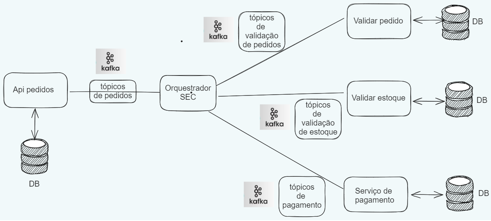

# Transações distribuídas em Microservices com Kafka

### Introdução aos Microservices

**Microservices** se trata de uma abordagem arquitetônica e organizacional para o desenvolvimento de software que consiste em pequenas aplicações (serviços) com suas APIs e comunicações bem definidas. Essa abordagem promove equipes e aplicações autossuficientes, especialistas em contextos específicos e independentes.

### Benefícios dos Microservices

A utilização de microservices aparece para solucionar problemas como:

- **Escalabilidade e Alta Disponibilidade:** Com microservices aliados a estratégias de DevOps, é possível identificar gargalos de forma facilitada, devido à separação de domínios das aplicações, e aplicar escalabilidade horizontal apenas nos pontos de gargalo.
- **Promoção de Técnicas de CI/CD:** Como um mesmo sistema possui suas funcionalidades distribuídas em serviços independentes, a integração e implantação de código também serão independentes, permitindo deploys a qualquer momento de qualquer parte do sistema.
- **Promoção do Desenvolvimento de Testes:** Utilizando serviços com contextos menores e bem definidos, os desenvolvedores terão um maior poder de teste, visto que não terão que realizar mocks de lógicas alheias à funcionalidade que estão desenvolvendo.

### Desafios dos Microservices

Apesar de solucionar alguns problemas, também surgem desafios como:

- **Complexidade do Sistema:** Um sistema monolítico, querendo ou não, é mais simples que um sistema de microservices distribuídos, pois todas as funcionalidades e regras de negócio são concentradas em um só lugar, facilitando lógicas de rollbacks, por exemplo.
- **Pontos de Falhas:** Quanto mais microservices o sistema tiver, mais pontos de falhas ele pode ter.
- **Observabilidade:** Como vamos trabalhar com mais pontos de falhas, a observabilidade se torna algo crucial para todos os microservices, coletando e analisando logs, métricas e traces (gerando um novo desafio, trace distribuído).
- **Consistência dos Dados:** Com o sistema distribuído, tornam-se necessárias práticas para manter a consistência dos dados em todos os pontos da aplicação, visto que com aplicações distribuídas, as transações que acontecem no sistema também serão distribuídas, necessitando do maior nível de consistência de dados possível.

### Transações Distribuídas em Microservices

Transações distribuídas nada mais são que transações normais, como em banco de dados, mas distribuídas ao longo dos microservices envolvidos no sistema distribuído. Ou seja, devem respeitar os princípios de atomicidade, consistência, isolamento e durabilidade.

### Exemplo de Transação Distribuída

Como um bom exemplo, podemos utilizar uma lógica de realizar um pedido em um sistema hipotético. Esse pedido segue a seguinte lógica:

1. Receber o pedido
2. Validar o pedido recebido
3. Validar o estoque
4. Criar a cobrança para o cliente

### Microservices e Rollback Distribuído

Dentro de um monolito, essa operação pode ser simples, podendo ser realizada dentro de um caso de uso, por exemplo. Mas, quando falamos de microservices, podemos quebrar essa lógica em 4 microservices independentes, e é aí que os desafios começam.

### Exemplo de Implementação com Microservices

Vamos supor a utilização de quatro microservices:

1. API para realizar a comunicação com sistemas/usuários externos
2. Serviço de validação de pedidos
3. Serviço de validação de estoque
4. Serviço de pagamento

Nesse caso, supondo um fluxo de “a” para “d”, se ocorrer algum erro, por exemplo, não ter o produto em estoque, a ordem de compra deve ser inteira cancelada. Esse rollback distribuído é uma operação crítica e muito mais complexa do que se tudo estivesse concentrado em apenas um monolito, pois surge a necessidade de comunicação entre os microservices de forma coordenada.

### Comunicação Assíncrona entre Microservices

Para sanar a necessidade de comunicação, e levando em conta que estamos trabalhando com sistemas distribuídos, nada melhor do que usarmos um sistema de comunicação que permita comunicação assíncrona entre aplicações. Nesses casos, me vêm à mente serviços como Kafka e RabbitMQ, dois brokers de mensagens amplamente utilizados, mas qual devo utilizar?

### Comparação entre RabbitMQ e Kafka

A escolha entre RabbitMQ e Kafka deve ser feita levando em conta o contexto da aplicação e o objetivo da comunicação assíncrona entre as aplicações.

- **RabbitMQ** trabalha com um sistema muito parecido com uma fila (estrutura de dados), excluindo a mensagem após ser consumida.
- **Kafka** trabalha com a ideia de Pub/Sub, onde produtores publicam mensagens (eventos) em tópicos e consumidores se inscrevem nesses tópicos para receber os eventos que serão transmitidos nesse tópico. O Kafka também trabalha com partições em seus tópicos, permitindo a distribuição de eventos em paralelo, ampliando a capacidade de leitura e escrita de um tópico.

Para esse exemplo, vou utilizar o Kafka devido à sua capacidade de retenção de eventos.

### Implementação de Padrão SAGA em Microservices

Ok, temos a estrutura de microservices definidas e a forma de comunicação entre eles, mas ainda precisamos fazer algo em relação ao fluxo de transação distribuída.

Para auxiliar no problema de transação que temos, podemos utilizar o padrão de microservices chamado de **SAGA**, que aparece para garantir que a execução de um fluxo de transação distribuída ocorra de forma correta e que, em caso de falhas, todos os rollbacks sejam executados.

### SAGA Orquestrado vs. SAGA Coreografado

As duas formas de implementação do padrão SAGA entregam o mesmo resultado, porém existem particularidades em cada uma.

- **SAGA Orquestrado**: Parte da adição de um novo microservice na arquitetura de microservice presente, responsável por centralizar todos os eventos nele e realizar de fato a orquestração desses eventos (SEC - Saga Execution Controller).
- **SAGA Coreografado**: Nessa abordagem, cada microservice tem conhecimento do serviço anterior e posterior a ele para que consiga executar o fluxo em casos de sucesso e de rollbacks.

Para esse exemplo, vou utilizar o padrão SAGA orquestrado e a organização de tópicos ficará da seguinte maneira:

1. Todos os microservices vão gerar eventos para o tópico “ORQUESTRADOR”, tópico consumido pelo SEC.
2. Cada microservice vai receber eventos de dois tópicos, um para o caso de realizar uma ação com sucesso e outro para realizar o rollback do evento da vez.

Exemplo de arquitetura.

### Considerações Finais

Um ponto que se deve levar em conta é a **idempotência de eventos**, ou seja, um evento de pagamento, por exemplo, não deve ser executado duas vezes, então mecanismos como identificador único e verificações em banco de dados devem ser implementados, principalmente em ambientes com redundância a nível de cluster do Kafka.
