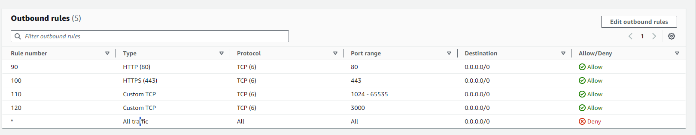
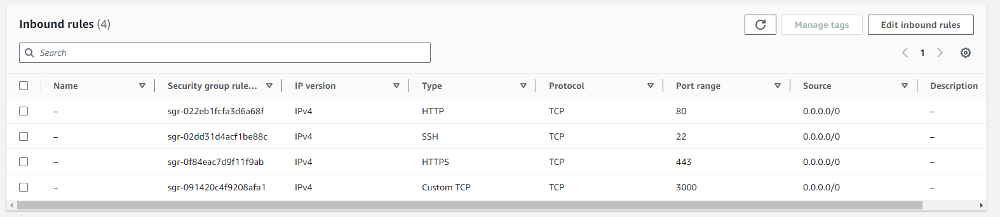
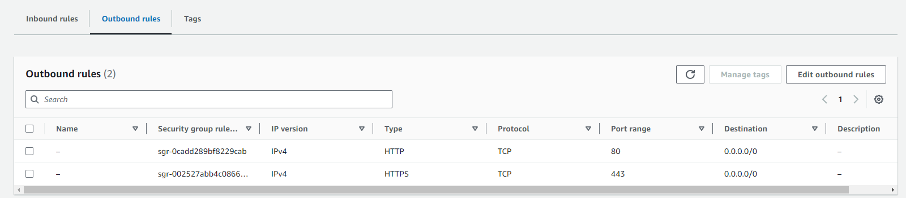

# Your first AWS EC2 application

Today we are going to host a NodeJs application on AWS EC2. This method is a simple “deploy” for beginners that has never hosted apps on AWS EC2.

This post will guide you on the journey to host your first application on AWS using services like EC2 and concepts of private clouds like VPCs and subnetworks using only free-tier resources.

Why AWS?

As a developer, may I know infrastructure?

1. **Create a simple NodeJS app**

    ```jsx
    import express from "express";

    const app = express();
    app.get("/", (req, res) => {

        res.send(`Hello World! => ${new Date()}`);
    });

    app.listen(3000, () => {
        console.log("The HTTP server is running on port 3000");
    });
    ```


2. **Aws tutorial**

    We need a list of AWS things:

    1. **VPC**: VPC is important to create an isolated environment for our app. To create one VPC, go to the VPC on AWS Console, and choose a good mask for your IPv4, this will be used to create subnetworks. I will use “10.0.0.0/24”. Ipv6 I do not use it. Do not forget to enable DHCP and DNS resolution and hostname in VPC settings.
    2. **Subnets**: Subnets are the “mini” networks inside the “main” network (VPC). We can create many subnets, privates, and publics. I will create only one public subnet to provide access to the world. Subnets need to be created inside one VPC. Here you need to choose another IPv4 mask, I will use 10.0.0.0/28.
    3. Internet Gateway: To allow apps inside one VPC to reach the Internet, we need to create one Internet Gateway and attach it to our VPC.
    4. Create Route Table: The Route Table must be attached to our VPC and one subnetword. Editing the routes of the Route Table, we can send all the traffic to your Internet Gateway (0.0.0.0/0 and::/0 ). This is the main thing to provide internet access to your EC2.
    5. Create ACL: ACL is like a firewall to your network. We can add rules to ports that our app can listen to. The ACL needs one VPC.

        Inbound rules.

        

        Outbound rules.

        

        In rules 80 and 90 for inbound traffic, and 90 and 100 for outbound traffic, I permit all HTTP and HTTPS traffic through our firewall to access the internet. For inbound rule 110, I allow SSH connections. Additionally, in inbound rule 100 and outbound rule 120, I enable traffic for port 3000, which is the port used by my application. Finally, for 120 rules, I allow traffic for ephemeral ports.

    6. Create Security Group: A Security group is like a firewall to your service. We can set up inbound and outbound rules here too.

        Inbound.

        

        Outbound.

        

        Here I allow the inbound traffic for HTTP and HTTPS to reach the internet, SSH to my remote connection, and a custom TCP for 3000 port. For outbound rules, I only allow HTTP and HTTPS rules.

    7. Now, create your EC2 instance and attach the VPC, and subnetwork, enable public IP, and use the security group.
    8. Elastic IP: This step must be optional. We can create an elastic IP and link to your EC2 to avoid the refresh IP if your EC2 reboots. Remember, idle elastics IP can be billed.
    9. Connection: Using the key that you create when the EC2 instance has been created, you want to connect to your instance. I use SSH in my WSL Ubuntu.

1. Now, we need to configure our EC2.
    - Install NodeJS

        ```bash
        sudo su -

        curl -o- https://raw.githubusercontent.com/nvm-sh/nvm/v0.34.0/install.sh | bash

        . ~/.nvm/nvm.sh

        nvm install node

        node -v

        node -v
        ```

    - Install Git

        ```bash
        sudo apt-get update -y
        sudo apt-get install git -y
        ```


    1. Ready

        Clone your app repository and run.


    Annotations:

    - In 2024 IPv4 is not free more, but if your account was in the free tier you have many hours per month of free public IPv4.
    - Be careful with idle resources, not forget to deactivate them if you do not use them anymore to avoid unnecessary costs.
    - You can use any application for this scenario but you need to set the EC2 environment to run your application
    - If you use a private GitHub repository, you need to set the SSH configuration to able communication between your EC2 and Github
    - Yes, some kinds of IAC are much better than this interface click tutorial, so see you later…

